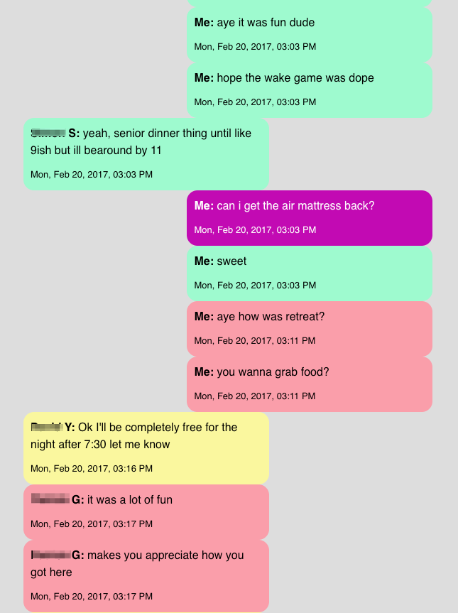

# Facebook Message Visualizer

This project generates HTML files that show all your Facebook conversations at a certain point in time.



### Prerequisites
- `node.js` installed on your system
- A local copy of your Facebook data in JSON form ([instructions](https://www.facebook.com/help/1701730696756992/?helpref=hc_fnav))
- (optional) `python` and `pipenv` installed on your system

### Usage

The HTML/CSS files generated with `scripts/gen.ts`. This script takes a couple of flags:
- (required) `ownName`: Your own (full) name, as it's shown on Facebook.
- (required) `fbJsonPath`: Path to the root of the facebook JSON data dump. This directory must contain the `messages` directory, and may also contain other directories such as `about_you` or `friends`.
- (required) `outputFolder`: Path to the folder that's outputted. TODO: use `mkdir_p` so that the folder doesn't have to already exist.
- (optional) `baseCssPath`: most of the stylistic choices can be decided before runtime. These are defined in a base CSS file. This defaults to `base.css`.
- (optional) `autogenCssPath`: the colors of conversations are set based on a hash of the conversation's participants, and thus are generated at runtime. This defaults to `autogen.css`.
- (optional) `writeBackupJson`: Setting this flag to `true` will write a single JSON file that contains all your messages, in addition to the usual a set of HTML files. This defaults to `false`.
- (optional) `backupJsonPath`: Sets where to write the aforementioned JSON file. This defaults to `backup.json`.

All paths should be specified relative to the current working directory, **except for `autogenCssPath`** - that is specified relative to the `outputFolder`. TODO: clean up that inconsistency

This script can take several minutes to run, depending on how many conversations it's reading. For reference, processing ~2k conversations takes approximately 3 minutes on a mid-tier 2019 MBP w/ 16gb RAM.

In addition, there is a `scripts/fix_json_encodings.py` script which can be helpful if your facebook JSON is encoded in a format that isn't UTF-16. This script uses the `ftfy` Python library to fix common encoding issues. To run this, simply invoke the script with the path to the root of the facebook JSON data dump. **Note that the `fix_json_encodings` script modifies your files in place!**

```bash
# Optional preprocessing for poorly encoded JSON
$ pipenv install && pipenv shell
$ python fix_json_encodings.py '../facebook-data'

$ npm i
$ npx ts-node scripts/gen.ts --ownName="Firstname Lastname" --fbJsonPath='../facebook-data' --outputFolder="generated"
```

### Contributing

Feel free to tackle any of the open issues or add one of your own!
